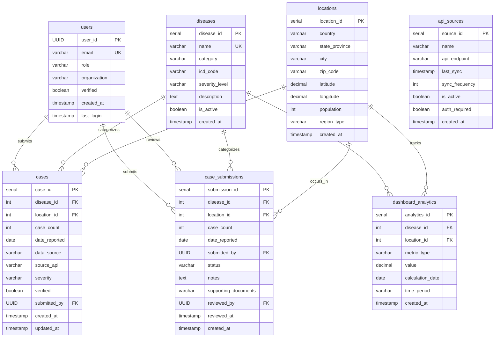

# Fluence Database Schema Documentation

## Overview
This document describes the database schema designed for the Fluence web application. 

## Table Definitions

### 1. `users`
Stores user accounts with role-based access control.

| Column | Type | Constraints | Description |
|--------|------|-------------|-------------|
| user_id | UUID | PRIMARY KEY | Unique identifier (matches Supabase auth.users) |
| email | VARCHAR(255) | UNIQUE, NOT NULL | User email address |
| role | VARCHAR(50) | CHECK, DEFAULT 'public' | User role: 'public', 'health_official', 'admin' |
| organization | VARCHAR(255) | NULL | Hospital/agency name for health officials |
| verified | BOOLEAN | DEFAULT FALSE | Whether account is verified |
| created_at | TIMESTAMP | DEFAULT NOW() | Account creation timestamp |
| last_login | TIMESTAMP | NULL | Last login timestamp |

---

### 2. `diseases`
Reference table for disease types and metadata.

| Column | Type | Constraints | Description |
|--------|------|-------------|-------------|
| disease_id | SERIAL | PRIMARY KEY | Unique identifier |
| name | VARCHAR(255) | UNIQUE, NOT NULL | Disease name (e.g., 'COVID-19') |
| category | VARCHAR(100) | NULL | Disease category (e.g., 'respiratory') |
| icd_code | VARCHAR(20) | NULL | International Classification of Diseases code |
| severity_level | VARCHAR(20) | CHECK | 'low', 'moderate', 'high', 'critical' |
| description | TEXT | NULL | Detailed description |
| is_active | BOOLEAN | DEFAULT TRUE | Whether disease is actively tracked |
| created_at | TIMESTAMP | DEFAULT NOW() | Record creation timestamp |

---

### 3. `locations`
Geographic reference data for mapping and filtering.

| Column | Type | Constraints | Description |
|--------|------|-------------|-------------|
| location_id | SERIAL | PRIMARY KEY | Unique identifier |
| country | VARCHAR(100) | NOT NULL | Country name |
| state_province | VARCHAR(100) | NULL | State or province |
| city | VARCHAR(100) | NULL | City name |
| zip_code | VARCHAR(20) | NULL | Postal code |
| latitude | DECIMAL(10,8) | NOT NULL | Geographic latitude |
| longitude | DECIMAL(11,8) | NOT NULL | Geographic longitude |
| population | INT | NULL | Population count |
| region_type | VARCHAR(20) | CHECK | 'city', 'county', 'state', 'country' |
| created_at | TIMESTAMP | DEFAULT NOW() | Record creation timestamp |

---

### 4. `cases`
Verified disease case data for visualization on heat maps.

| Column | Type | Constraints | Description |
|--------|------|-------------|-------------|
| case_id | SERIAL | PRIMARY KEY | Unique identifier |
| disease_id | INT | FK → diseases, NOT NULL | Associated disease |
| location_id | INT | FK → locations, NOT NULL | Geographic location |
| case_count | INT | NOT NULL, CHECK ≥ 0 | Number of cases reported |
| date_reported | DATE | NOT NULL | Date cases were reported |
| data_source | VARCHAR(50) | CHECK | 'api', 'manual_submission', 'hospital' |
| source_api | VARCHAR(100) | NULL | API name if data_source = 'api' |
| severity | VARCHAR(20) | CHECK | 'mild', 'moderate', 'severe' |
| verified | BOOLEAN | DEFAULT FALSE | Whether data has been verified |
| submitted_by | UUID | FK → users, NULL | User who submitted (if manual) |
| created_at | TIMESTAMP | DEFAULT NOW() | Record creation timestamp |
| updated_at | TIMESTAMP | DEFAULT NOW() | Last update timestamp |

---

### 5. `case_submissions`
Pending case submissions awaiting review by administrators.

| Column | Type | Constraints | Description |
|--------|------|-------------|-------------|
| submission_id | SERIAL | PRIMARY KEY | Unique identifier |
| disease_id | INT | FK → diseases, NOT NULL | Associated disease |
| location_id | INT | FK → locations, NOT NULL | Geographic location |
| case_count | INT | NOT NULL, CHECK ≥ 0 | Number of cases reported |
| date_reported | DATE | NOT NULL | Date cases were reported |
| submitted_by | UUID | FK → users, NOT NULL | User who submitted |
| status | VARCHAR(20) | CHECK, DEFAULT 'pending' | 'pending', 'approved', 'rejected' |
| notes | TEXT | NULL | Submission notes or justification |
| supporting_documents | VARCHAR(500) | NULL | File paths/URLs for evidence |
| reviewed_by | UUID | FK → users, NULL | Admin who reviewed submission |
| reviewed_at | TIMESTAMP | NULL | Review timestamp |
| created_at | TIMESTAMP | DEFAULT NOW() | Submission timestamp |

---

### 6. `api_sources`
Configuration for external API integrations (CDC, WHO, etc.).

| Column | Type | Constraints | Description |
|--------|------|-------------|-------------|
| source_id | SERIAL | PRIMARY KEY | Unique identifier |
| name | VARCHAR(100) | NOT NULL | API source name |
| api_endpoint | VARCHAR(500) | NULL | API base URL |
| last_sync | TIMESTAMP | NULL | Last successful data sync |
| sync_frequency | INT | NULL | Sync interval in minutes |
| is_active | BOOLEAN | DEFAULT TRUE | Whether API is currently enabled |
| auth_required | BOOLEAN | DEFAULT FALSE | Whether API requires authentication |
| created_at | TIMESTAMP | DEFAULT NOW() | Record creation timestamp |

---

### 7. `dashboard_analytics`
Pre-computed analytics for dashboard performance.

| Column | Type | Constraints | Description |
|--------|------|-------------|-------------|
| analytics_id | SERIAL | PRIMARY KEY | Unique identifier |
| disease_id | INT | FK → diseases, NULL | Associated disease (NULL = all diseases) |
| location_id | INT | FK → locations, NULL | Associated location (NULL = all locations) |
| metric_type | VARCHAR(50) | CHECK | 'total_cases', 'trend', 'growth_rate' |
| value | DECIMAL(15,2) | NULL | Calculated metric value |
| calculation_date | DATE | NOT NULL | Date metric was calculated |
| time_period | VARCHAR(20) | CHECK | 'daily', 'weekly', 'monthly' |
| created_at | TIMESTAMP | DEFAULT NOW() | Record creation timestamp |

---

## Entity Relationship Diagram
